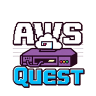

# AWS Lab Quest
<div align="center">



> Plataforma de preparação para certificações AWS com gamificação, modos de estudo adaptativos e pipeline de conteúdo via IA.

[](https://nextjs.org)
[](https://typescriptlang.org)
[](https://prisma.io)
[](https://bullmq.io)
[](LICENSE)

---

## O que é

**AWS Lab Quest** é uma aplicação web em português voltada para quem está se preparando para certificações AWS. O app transforma o estudo em uma experiência de RPG: o aluno ganha XP, sobe de nível, desbloqueia conquistas e compete em um ranking em tempo real — tudo enquanto pratica questões e executa labs temáticos gerados com IA.

### Modos de estudo

Três modos formam o núcleo (em ordem crescente de formalidade), e dois modos mais recentes reaproveitam a mesma máquina de perguntas/revelação de resposta:

| Modo | Descrição |
|---|---|
| **Lab** | Quests temáticas geradas por IA com contexto personalizado (ex: musica, games, esporte) |
| **KC (Knowledge Check)** | Bateria de questões por serviço ou tópico para revisão pontual |
| **Simulado** | Prova completa com timer, detecção de questões marcadas, revisão pré-envio e score final |
| **Arena** | Batalhas contra bosses temáticos — cada questão correta causa dano; a UI de pergunta/revelação do Simulado é reaproveitada |
| **Trilhas** | Trilhas guiadas por tópico, com estágios que se desbloqueiam progressivamente |

### Gamificação

- **XP & Níveis** — Cada atividade concede XP proporcional à dificuldade (`XpWeightConfig`), com 6 tiers de nível
- **Badges por nível** — Artes geradas via Pollinations API, exibidas no perfil e compartilháveis
- **12 Conquistas** — Desbloqueadas automaticamente por marcos de desempenho no histórico de sessões
- **Leaderboard em tempo real** — Ranking ao vivo via Supabase Realtime
- **Mentor IA** — Recomendações de estudo priorizadas (revisão de serviço fraco, flashcards vencidos, KC focado) calculadas de forma determinística a partir do histórico, sem chamadas de IA
- **Biblioteca Contextual** — Materiais complementares (PDF, imagem, markdown, slides) vinculados a um serviço AWS ou trilha, sugeridos automaticamente no Mentor e nas telas de revisão de gap quando o aluno demonstra dificuldade naquele tema

---

## Arquitetura

```
┌─────────────────────────────────┐     ┌──────────────────────┐
│          awlq-app               │     │     awlq-worker      │
│        (Next.js 16)             │     │  (BullMQ + Node.js)  │
│                                 │     │                      │
│  App Router ─ API Routes        │     │  source-fetch        │
│  Zustand ─ Framer Motion        │     │  question-generation │
│  Better Auth ─ Prisma           │     │  feedback-analysis   │
│  Supabase Realtime              │◄────│  performance-compute │
│                                 │     │  quality-review      │
└────────────┬────────────────────┘     │  email-send          │
             │                         └──────────┬───────────┘
             ▼                                    ▼
      ┌──────────────┐              ┌─────────────────────────┐
      │  PostgreSQL  │              │  Redis (BullMQ queues)  │
      └──────────────┘              └─────────────────────────┘
             │
      ┌──────┴──────┐
      │  Supabase   │  ← Storage (avatars, badges) + Realtime
      └─────────────┘
```

O **app** serve o frontend e expõe as APIs REST — tudo síncrono: páginas, rotas de API, autenticação. O **worker** roda separado e executa tudo que é lento ou assíncrono: geração de questões via IA, análise de áreas fracas, cálculo de métricas de desempenho, revisão de qualidade, email, ingestão de PDF. Os dois processos compartilham o mesmo schema Prisma (`packages/db/prisma/schema.prisma`) e o mesmo banco Postgres — não há API entre eles, a comunicação é via banco/fila.

O app aciona o worker de duas formas: escrevendo uma linha em `WorkerTrigger` (lida a cada 30s pelo `trigger-poller.ts`) ou empurrando diretamente numa fila BullMQ.

### O ciclo de conteúdo autoalimentado

Este é o mecanismo central do produto — a atividade de estudo constantemente reavalia e regenera o banco de questões:

```
StudySessionHistory (respostas do usuário)
  → feedback-analysis.worker    (marca áreas fracas, correctRate < 60%)
  → question-generation.worker  (prompt Gemini ponderado por ExamBlueprintDomain)
  → performance-compute.worker  (correctRate, índice de discriminação)
  → quality-review.worker       (IA aposenta ou reescreve questões de baixa qualidade)
  → de volta ao pool de estudo

source-fetch.worker (em paralelo): baixa Exam Guides da AWS → extrai domínios do blueprint
```

Cada worker tem concorrência limitada (`concurrency: 1` para qualquer um que chame IA); jobs são idempotentes quando possível, e colisão de `usageHash` é o único caso em que um no-op silencioso é aceitável.

---

## Stack

### awlq-app (Frontend + API)
| Camada | Tecnologia |
|---|---|
| Framework | Next.js 16 (App Router) + React 19 |
| Linguagem | TypeScript 5 |
| Estilo | Tailwind CSS 4 + Radix UI |
| Auth | Better Auth 1.5 (email/senha, sessões) |
| ORM | Prisma 7 + PostgreSQL |
| Storage & Realtime | Supabase |
| AI | Google Gemini API (`@google/generative-ai`) |
| Estado | Zustand 5 |
| Animações | Framer Motion 12 |
| Email | Nodemailer (Gmail SMTP) |

### awlq-worker (Background Jobs)
| Camada | Tecnologia |
|---|---|
| Filas | BullMQ 5 + IORedis |
| ORM | Prisma 7 (DB compartilhado) |
| AI | Google Gemini API |
| Logs | Pino 9 |
| Runtime | Node.js 22 / Bun |

---

## Pré-requisitos

- Node.js 22+ (ou Bun)
- Docker + Docker Compose
- Conta Google Cloud com Gemini API habilitada
- Projeto Supabase (Storage + Realtime)
- Conta Gmail com App Password habilitado

---

## Configuração Local

### 1. Clone e instale dependências

```bash
git clone https://github.com/seu-usuario/aws-lab-quest.git
cd aws-lab-quest

# App
cd awlq-app && npm install
cd ../awlq-worker && npm install
cd ..
```

### 2. Configure variáveis de ambiente

```bash
cp .env.example awlq-app/.env
cp .env.example awlq-worker/.env
```

Edite os arquivos `.env` preenchendo as variáveis descritas na seção abaixo.

### 3. Suba os serviços de infraestrutura

```bash
docker compose up -d postgres redis
```

> O `docker-compose.yml` na raiz orquestra todos os serviços. Para desenvolvimento, suba apenas `postgres` e `redis` e rode o app/worker localmente.

### 4. Configure o banco de dados

```bash
cd awlq-app
npm run db:generate   # gera o Prisma Client
npm run db:migrate    # aplica as migrations
npm run db:seed       # popula dados iniciais (badges, conquistas, serviços AWS)
```

> Após qualquer alteração no schema, rode `npm run prisma:generate` também dentro de `awlq-worker/` — ele consome o mesmo `schema.prisma` mas mantém seu próprio client gerado.

### 5. Inicie os serviços

Em terminais separados:

```bash
# Terminal 1 — App Next.js
cd awlq-app && npm run dev

# Terminal 2 — Worker BullMQ
cd awlq-worker && npm run dev
```

Acesse: **http://localhost:3000**

---

## Variáveis de Ambiente

Crie os arquivos `.env` baseados no [`.env.example`](.env.example).

### Obrigatórias

| Variável | Descrição |
|---|---|
| `DATABASE_URL` | URL de conexão PostgreSQL |
| `REDIS_URL` | URL do Redis (ex: `redis://localhost:6379`) |
| `BETTER_AUTH_SECRET` | String aleatória ≥ 32 caracteres |
| `BETTER_AUTH_URL` | URL base da aplicação |
| `GEMINI_API_KEY` | Chave da Google Generative AI |
| `SUPABASE_URL` | URL do projeto Supabase |
| `SUPABASE_SERVICE_ROLE_KEY` | Service role JWT do Supabase |
| `SUPABASE_ANON_KEY` | Anon key do Supabase |
| `MAIL_USERNAME` | Email Gmail para envio |
| `MAIL_PASSWORD` | App Password do Gmail |

### Opcionais

| Variável | Padrão | Descrição |
|---|---|---|
| `GEMINI_MODEL` | `gemini-2.5-flash` | Modelo Gemini para geração |
| `POLLINATIONS_API_KEY` | — | Chave para geração de imagens de badges |
| `ADMIN_EMAIL` | — | Email do admin inicial (seed) |
| `ADMIN_PASSWORD` | — | Senha do admin inicial (seed) |
| `WEAK_AREA_THRESHOLD` | `0.60` | Taxa mínima de acerto para área fraca |
| `TRIGGER_POLL_INTERVAL_MS` | `30000` | Intervalo do poller de triggers (ms) |
| `LOG_LEVEL` | `info` | Nível de log do worker |

---

## Autenticação e controle de acesso

Better Auth 1.5 (email/senha) — config em `lib/auth.ts`, helpers de cliente em `lib/auth-client.ts`. Novos usuários nascem com `accessStatus: pending` e dependem de aprovação manual em `/admin/users` (ou de um bypass via `SystemConfig.auto_approve_users`). Toda rota `api/admin/*` chama `requireAdmin(request)`, que valida sessão **e** `role === "admin"`.

---

## Testes

Vitest (`environment: "node"`, globals ligado), um `vitest.config.ts` por pacote. Os testes preferem exercitar o handler da rota de API diretamente (mockando `@/lib/prisma` e singletons adjacentes) a subir o dev server.

```bash
# awlq-app
cd awlq-app
npm run test                                   # roda toda a suíte
npx vitest run src/__tests__/arena.test.ts     # um arquivo específico
npx vitest run -t "nome do teste"              # filtra por nome

# awlq-worker
cd awlq-worker
npm run test
```

Antes de abrir um PR, o mínimo exigido pelo `CONTRIBUTING.md` é `npm run lint`, `npx tsc --noEmit` e `npx next build` limpos em `awlq-app`, mais `npx tsc --noEmit` limpo em `awlq-worker`.

---

## Deploy com Docker

Para produção, suba todos os serviços de uma vez:

```bash
# Crie a rede externa (apenas uma vez)
docker network create rt-network

# Build e start
docker compose up -d --build
```

Os serviços `rt-awslq-app` (porta 3000) e `rt-awslq-worker` sobem na rede `rt-network`.

```bash
docker compose logs -f          # acompanhar logs
docker compose down             # parar tudo
docker compose restart worker   # reiniciar só o worker
```

---

## Estrutura do Projeto

```
aws-lab-quest/
├── awlq-app/               # Next.js app (frontend + API)
│   └── src/
│       ├── app/            # App Router — routing fino + data fetching (páginas e API routes)
│       ├── components/     # Componentes reutilizáveis (ui/, layout/)
│       ├── features/       # Lógica por domínio, cada um com components/hooks/screens/services
│       ├── hooks/          # Custom hooks React
│       ├── lib/            # Singletons: auth, prisma, ai, storage, redis, levels, achievements
│       └── stores/         # Zustand stores
│
├── awlq-worker/            # Worker BullMQ (processamento em background)
│   └── src/
│       ├── workers/        # Um processador por fila (source-fetch, question-generation, ...)
│       ├── services/       # Lógica de negócio desacoplada da fila (blueprint-parser, weak-area-analyzer, ...)
│       ├── shared/         # Compartilhado com o app: buildUsageHash, validateQuestion, persistQuestion
│       ├── cron/           # Jobs recorrentes do BullMQ (padrões salvos em ScheduledJob)
│       └── queues/         # As 5 filas BullMQ + tipos de payload
│
├── packages/db/prisma/     # Schema Prisma, migrations e client — compartilhado por app e worker
├── docs/                   # Documentação técnica complementar
├── docker-compose.yml
└── .env.example
```

Convenção de rotas no app: `src/app/` fica fino (roteamento + data fetch no servidor), a lógica de domínio mora em `src/features/<domínio>/`.

---

## Fluxos Principais

### Exam Guide e Simulado

1. Admin envia o guia oficial em **`/admin/upload`** (tipo: Exam Guide)
2. Sistema extrai blueprint de domínios e pesos automaticamente
3. Sem Exam Guide, o endpoint de questões retorna erro de bloqueio
4. Admin envia PDF de simulado para ingestão de questões

### Pipeline de Questões via IA

```
PDF/Markdown → Extração → Segmentação de blocos → Gemini API
→ Validação (schema, mínimo de opções) → Deduplicação (usageHash)
→ Persistência no banco
```

O worker também gera variantes mais difíceis de questões já respondidas automaticamente para evitar repetição em simulados futuros.

### Conquistas

Desbloqueadas automaticamente ao salvar histórico de lab/KC/simulado. A galeria em `/achievements` exibe progresso, unlock e link público de compartilhamento.

---

## Documentação Técnica

| Documento | Descrição |
|---|---|
| [achievements-system.md](docs/achievements-system.md) | Sistema de conquistas e desbloqueio |
| [simulado-pdf-pipeline.md](docs/tech/simulado-pdf-pipeline.md) | Pipeline PDF → Questão |
| [platform-upgrade-2026-03.md](docs/platform-upgrade-2026-03.md) | Arquitetura e melhorias recentes |
| [question-ingestion-refactor-2026-03.md](docs/tech/question-ingestion-refactor-2026-03.md) | Refactor do worker de ingestão |
| [create-lab-quest-v1.md](docs/showcase/labs/create-lab-quest-v1.md) | Como criar um Lab Quest |
| [CONTRIBUTING.md](CONTRIBUTING.md) | Como contribuir com o projeto |

---

## Contribuindo

Contribuições são bem-vindas! Leia o [guia de contribuição](CONTRIBUTING.md) para saber como reportar bugs, sugerir melhorias e enviar pull requests.

---

## Licença

MIT © [AWS Lab Quest Contributors](LICENSE)
